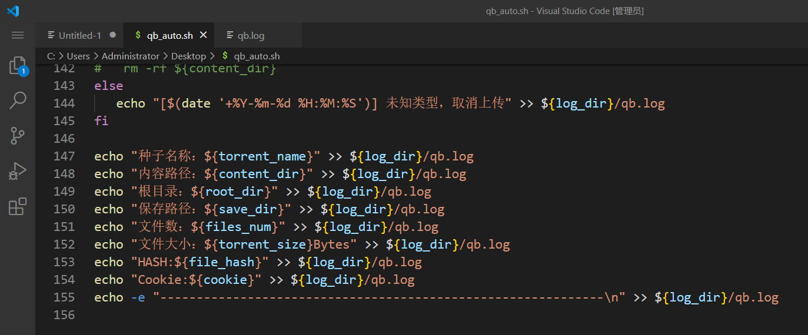

github: https://github.com/haruki1953/qb_auto

项目背景
- https://sakiko.top/vps-auto-bangumi
- https://github.com/haruki1953/bangumi-list-vue3
- https://github.com/haruki1953/crawl_post_generator

## 想到办法实现番剧小窝的更新提示了
就像自己最早搭建自动追番时提到的，qb番剧下载后，会执行一个脚本来将文件发送到onedrive。


可以通过这个来实现番剧的更新记录。其实脚本本身就有记录日志，再改起来应该很容易。可以将其信息再保存至网站目录下的一个文件，然后前端来获取，实现番剧更新提示（卡片上显示“new标签”）
 
 

决定在脚本最后调用 python 脚本来处理数据
```sh
# 调用 Python 脚本并传递参数
# python3
python ./bangumi-update.py "$torrent_name" "$content_dir" "$root_dir" "$save_dir" "$files_num" "$torrent_size" "$file_hash"
```


## update.json 数据类型
```ts
interface FileUpdateInfo {
	fileName: string
	filePath: string
	fileSize: number
	fileHash: string
	fileDate：string
}
```

示例 update.json
```json
[
    {
        "fileName": "[LoliHouse] Kabushikigaisha Magi-Lumière - 04 [WebRip 1080p HEVC-10bit AAC SRTx2].mkv",
        "filePath": "/root/Downloads/Sakiko/Bangumi/魔法光源股份有限公司/Season 1",
        "fileSize": 788255263,
        "fileHash": "2f258c68b2adf2819b6ddb64aea927091b7bd49c",
        "fileDate": "2024-10-26T20:36:00.858755"
    },
    {
        "fileName": "[ANi] 蜻蛉高球 - 17 [1080P][Baha][WEB-DL][AAC AVC][CHT].mp4",
        "filePath": "/root/Downloads/Sakiko/Bangumi/喂！蜻蜓/Season 1",
        "fileSize": 368911875,
        "fileHash": "e30e46e1e6ad498a31c1fc9ce814ce969bcf2acf",
        "fileDate": "2024-10-26T20:35:59.731397"
    }
]
```

## config.json 添加了 bgmLastUpdate
脚本每次执行，将修改 config.json 的 bgmLastUpdate 字段，保存当前时间
```json
{
    "bgmLastUpdate": "2024-10-26T20:36:00.861753"
}
```

前端据此在 bgmLastUpdate 时再重新获取update.json